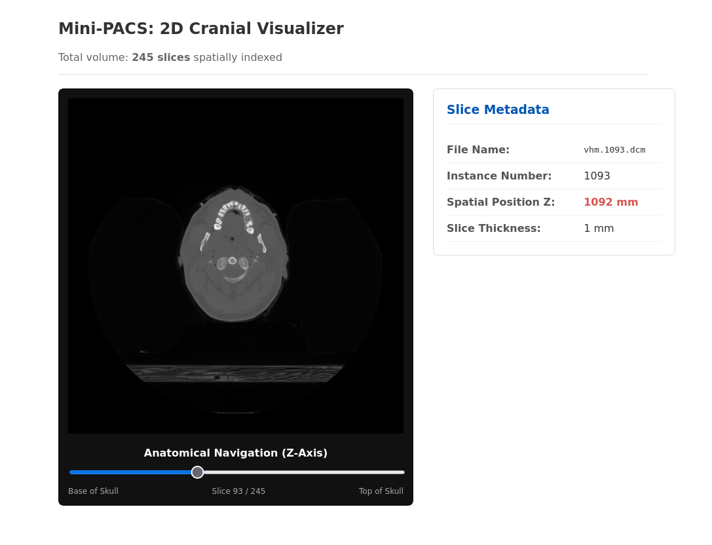

# Mini-PACS: 2D DICOM Medical Image Viewer

A lightweight, production-ready medical image archiving and communication system (PACS) designed to parse, index, and stream DICOM volumetric data of a human cranium.


## Features
- **DICOM Metadata Indexing**: Scans raw volumetric files and extracts precise spatial coordinates along the Z-axis.
- **Relational Storage**: Caches metadata in a SQLite database via Pandas for optimized sub-millisecond querying.
- **Asynchronous FastAPI Backend**: Real-time streaming of DICOM pixel arrays converted to normalized PNGs on-the-fly.
- **React Frontend**: Smooth anatomical scrolling using a debounced rendering system to prevent server overhead.
- **Dockerized Architecture**: Standardized multi-container deployment ready for modern DevOps pipelines.

---

## 🖥️ User Interface Overview

Below is a preview of the interactive Mini-PACS web interface, featuring real-time cranial volume navigation along the Z-axis and instantaneous DICOM metadata extraction.



---

## Project Structure

```text
DICOM_Metadata/
├── dicom-backend/           # Python FastAPI Server
│   ├── vhm_head/            # Raw DICOM slices (Volume)
│   ├── api.py               # REST API endpoints & Image streaming
│   ├── main.py              # Database indexing pipeline
│   ├── Dockerfile           # Backend container instructions
│   └── requirements.txt     # Python package dependencies
├── dicom-frontend/          # React SPA (Vite)
│   ├── src/                 # Visualizer frontend code
│   └── package.json         # Node.js dependencies
├── docker-compose.yml       # Orchestration script
└── .gitignore               # Excluded development files (venv, node_modules, db)
```

## Tech Stack
- **Frontend**: React, Vite
- **Backend**: FastAPI, Uvicorn, Pydicom, NumPy, Pillow
- **Database**: SQLite, Pandas
- **DevOps**: Docker, Docker Compose

## Installation & Quick Start
You can run this project either via **Docker Compose** (recommended for production/review) or **Locally** (for development).

### Option 1 : Running with Docker Compose (Fastest)
1. Make sure Docker and Docker Compose are installed on your machine.
2. From the root directory (`DICOM_Metadata/`), spin up the backend infrastructure:
    ```bash
    docker compose up --build
    ```
3. The API will automatically index the files and start listening on `http://localhost:8000`.

### Option 2: Running Locally (Development Mode)
1. **Backend Setup:**
Navigate to the backend folder, create your virtual environment, and install dependencies:
   ```bash
   cd dicom-backend
   python3 -m venv venv
   source venv/bin/activate
   pip install -r requirements.txt
   ```
Run the indexer to parse the DICOM files and build the SQLite database:
    ```bash
    python main.py
    ```
Start the asynchronous API server:
    ```bash
    uvicorn api:app --reload
    ```
The backend is now running at `http://127.0.0.1:8000`. You can test the API output at `http://127.0.0.1:8000/api/slices`.

2. **Frontend Setup:**
Open a second terminal, navigate to the frontend folder, install packages, and launch the development server:
   ```bash
   cd dicom-frontend
   npm install
   npm run dev
   ```
Open your browser and navigate to the local URL displayed by Vite (usually `http://localhost:5173`).

## Core API Endpoints
-   `GET /` : Health check and welcome message.
-   `GET /api/slices` : Returns the complete list of 245 cranial slices sorted anatomically by their Z-axis coordinate.
-   `GET /api/slices/{instance_number}/image : Dynamically extracts raw pixel arrays from the selected DICOM file, applies 0-255 grayscale normalization, and streams it as a standard native PNG.